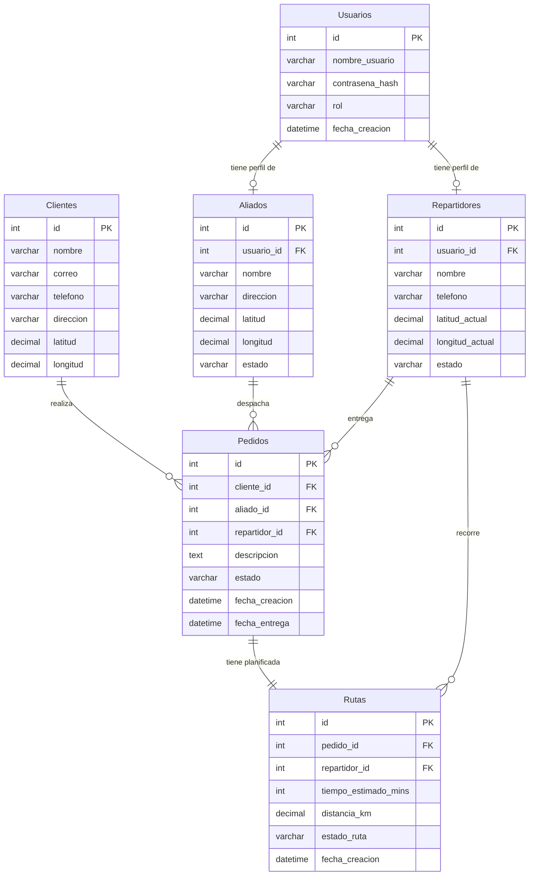

# Modelado de Base de Datos - Ruta Fácil

Este documento explica el modelo Entidad-Relación y aspectos de seguridad diseñados para el proyecto MultiFast (Ruta Fácil).

## Diagrama Entidad-Relación (Mermaid)

## Explicación de las Entidades

1. **Usuarios:** Concentra la lógica de autenticación (Ciberseguridad). Almacenará los roles (`admin`, `aliado`, `repartidor`) y contraseñas fuertemente encriptadas (ej. con `bcrypt`). De esta forma unificamos el login y seccionamos el acceso mediante RBAC (Role-Based Access Control).
2. **Aliados (Tiendas/Bodegas):** Entidad que abastece los productos. Es vital conocer sus coordenadas (`latitud`, `longitud`) para que el algoritmo determine la tienda óptima.
3. **Repartidores:** Entidad que transporta los pedidos. La latitud y longitud actual de estos actores se utilizará en conjunto con la del Aliado para encontrar al repartidor más apto en tiempo real.
4. **Clientes:** Compradores finales.
5. **Pedidos:** Entidad central del negocio. Inicia con un estado `pendiente`, y una vez el "agente de IA" o algoritmo procesa, se le asigna un `aliado_id` (tienda de recolección) y un `repartidor_id` (quien entrega).
6. **Rutas:** Permite persistir las métricas de eficiencia (distancia, tiempo estimado), lo cual es uno de los objetivos académicos del proyecto (evaluar `O(n)` vs `O(1)` en cálculo de rutas).

## Estrategias de Ciberseguridad Aplicadas

> [!TIP]
> **Seguridad en la capa de datos**

- **Contraseñas Seguras:** El campo `contrasena_hash` nunca almacenará texto plano. Es indispensable aplicar algoritmos criptográficos robustos en el backend (Django).
- **Protección de Datos Geográficos:** Las ubicaciones en tiempo real (`latitud_actual`, `longitud_actual` de *Repartidores*) son datos sensibles. Las API que sirvan esta información deben estar autenticadas mediante JWT y limitadas al rol de `admin`.
- **Mitigación de SQL Injection:** El diseño sugiere el uso de sentencias preparadas (Prepared Statements) o un ORM robusto (Django ORM). Ningún dato proporcionado por el usuario debe inyectarse crudo en las sentencias.
- **Auditoría (Trazabilidad):** Se implementan fechas de creación (`fecha_creacion`) e índices de estado para rastrear el progreso y detectar anomalías en la asignación masiva de pedidos.
