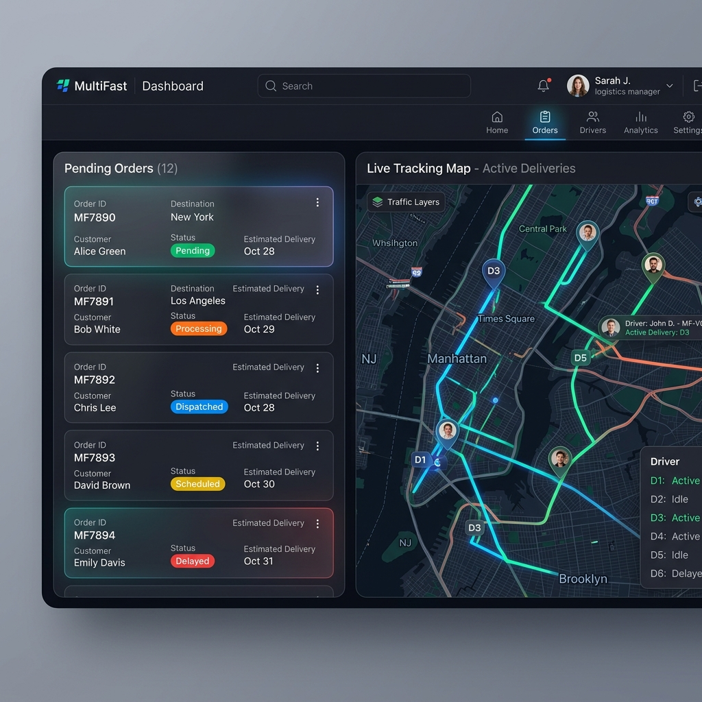
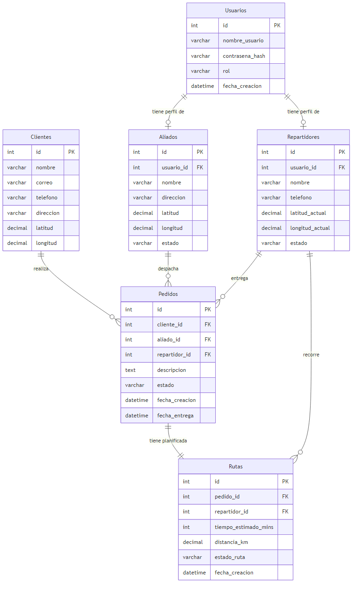

# Documentación Técnica: Plataforma "Ruta Fácil" (MultiFast)

Este documento detalla la arquitectura de la aplicación, explicando el contenido del código del front-end y la estructura de la base de datos, acompañado de representaciones visuales y un glosario para facilitar la comprensión.

---

## 1. Interfaz de Usuario (Front-End)

El código de la aplicación cliente está desarrollado utilizando **React** y empaquetado con **Vite**. Su propósito es proporcionar un panel de control interactivo (Dashboard) para monitorear y asignar pedidos logísticos en tiempo real.

### Estructura del Código (`frontend/src/App.jsx`)
- **Gestión de Estado (`useState`)**: Se utilizan variables de estado para manejar la lista de pedidos (`orders`) y para controlar los botones interactivos (`isAssigning`), simulando así el comportamiento en vivo del sistema.
- **Renderizado Dinámico**: Se iteran sobre listas de *Mock Data* (datos de prueba) de pedidos y repartidores, mostrando sus estados (`Pendiente`, `Asignado`, `En ruta`, `Disponible`) de manera reactiva.
- **Simulación de IA**: Contiene una función `handleAssignOrders` que emula el procesamiento del algoritmo de asignación de rutas (O(n) o O(1)). Al presionar el botón "Asignar a más cercano", el sistema calcula y asocia los pedidos pendientes a los repartidores más óptimos.
- **Estilos y Diseño (`App.css`, `index.css`)**: Se emplean hojas de estilo en CSS puro con un enfoque en diseño moderno (modo oscuro, colores vibrantes, glassmorfismo y tipografía legible), garantizando una experiencia de usuario premium (UX/UI).

> [!TIP]
> **Animaciones y Micro-interacciones:** El código integra pequeñas transiciones CSS que hacen que el panel se sienta vivo y responsivo cuando cambian los estados de los pedidos.

### Pantallazo: Dashboard de Asignación Logística

*Figura 1: Mockup visual del Dashboard generado por el front-end, mostrando la lista de pedidos pendientes y un mapa de seguimiento GPS.*

---

## 2. Base de Datos (Back-End)

El esquema de la base de datos ha sido diseñado para gestionar de manera relacional la operación logística, desde los usuarios hasta la entrega final del pedido.

### Estructura de Tablas (`schema.sql`)
1. **`Usuarios`**: Tabla central que concentra las credenciales y la seguridad. Define roles específicos (`admin`, `aliado`, `repartidor`) para controlar el acceso mediante RBAC.
2. **`Aliados`**: Representa a las bodegas o tiendas que abastecen los pedidos. Almacena sus coordenadas geográficas exactas.
3. **`Repartidores`**: Transportistas que repartirán los paquetes. Almacena su latitud y longitud actual para el cálculo de distancia.
4. **`Clientes`**: Información de los compradores finales.
5. **`Pedidos`**: El corazón del negocio. Un pedido vincula a un cliente, puede ser asignado a un Aliado (bodega) y a un Repartidor, pasando por distintos estados (`pendiente`, `asignado`, `en_transito`, `entregado`, `cancelado`).
6. **`Rutas`**: Almacena el histórico y las métricas de rendimiento (como la distancia en km y el tiempo estimado). Esto es crucial para la materia de "Análisis de Algoritmos", permitiendo evaluar la eficiencia de las asignaciones.

> [!IMPORTANT]
> **Ciberseguridad Aplicada:** El esquema restringe valores incorrectos (cláusulas `CHECK`), asegura la encriptación de contraseñas (`contrasena_hash`), e indexa ubicaciones geográficas para evitar latencia y proteger datos sensibles.

### Pantallazo: Diagrama Entidad-Relación (ER)

*Figura 1: Arquitectura y relaciones del modelo relacional en la base de datos (traducido al español).*

---

## 3. Glosario de Términos

Para un mejor entendimiento técnico y operativo, a continuación se detallan los conceptos clave utilizados a lo largo del código y del esquema de datos:

- **RBAC (Role-Based Access Control):** Sistema de control de acceso basado en roles. Garantiza que un `aliado` no pueda acceder a los datos de un `repartidor`, y que solo el `admin` pueda visualizar el mapa completo.
- **Vite / React:** Tecnologías modernas para la creación de interfaces web. Vite proporciona un servidor de desarrollo ultra rápido y React maneja los componentes visuales interactivos.
- **Mock Data:** Conjunto de datos simulados (ficticios) insertados directamente en el código para visualizar cómo funcionará la aplicación antes de conectarse a una base de datos real.
- **ORM (Object-Relational Mapping):** Herramienta que permite interactuar con la base de datos mediante programación orientada a objetos (recomendado para conectar este frontend con el backend a futuro), evitando consultas SQL crudas y mejorando la seguridad.
- **Hash de Contraseñas:** Algoritmo matemático (`bcrypt` o `argon2`) utilizado en la tabla `Usuarios` que convierte la contraseña en una cadena de texto ilegible para prevenir robos de credenciales en caso de vulnerabilidades.
- **Foreign Key (Clave Foránea):** Vínculo estructural en las bases de datos relacionales que conecta dos tablas (por ejemplo, el `usuario_id` que liga a un "Repartidor" con sus credenciales de "Usuario").
- **Latitud y Longitud:** Coordenadas espaciales esenciales para el funcionamiento del proyecto. Permiten al algoritmo evaluar la distancia euclidiana (o a través de una API de mapas) entre el Aliado y el Repartidor en tiempo de ejecución de algoritmos O(n) y O(1).
